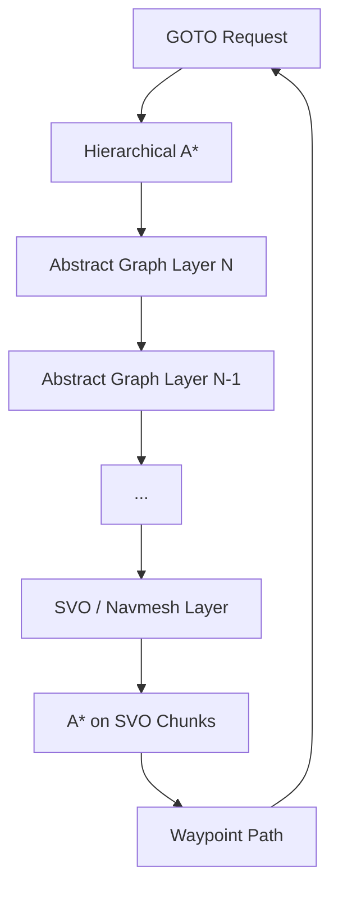

# Epic: Hierarchical A* Navigation System

A multi-level pathfinding system using graph abstractions at every level except the bottom-most, which is either a navmesh (deferred) or a sparse voxel octree (SVO) grid. This epic covers the core pathfinding infrastructure needed for NPC GOTO tools, audio propagation queries, and future spatial reasoning.

## Architecture

## Layers

| Layer | Representation | Pathfinding |
|-------|---------------|-------------|
| Abstract (L2+) | Cluster graph with portals | Hierarchical A* (graph) |
| Chunk (L1) | Section-based SVO chunks | A* on sparse voxel octree |
| Ground (L0) | Navmesh or dense voxel grid | Deferred (navmesh) / implemented (SVO) |

## Design Principles

- **Graph-first**: every level above L0 is a graph. Nodes = regions/portals. Edges = connectivity + cost.
- **SVO as source of truth**: static geometry → SVO → graph extraction → hierarchical reduction.
- **Dynamic blockers**: simple convex obstacles overlaid on SVO; trigger local re-planning, not full rebuild.
- **Reuse**: the same SVO and hierarchical A* engine serves navigation, audio propagation (rpg-llm04), and future spatial queries.

## Sub-tickets

| Ticket | Description |
|--------|-------------|
| [rpg-nav02](rpg-nav02.md) | Sparse Voxel Octree (SVO) grid with section-based chunking |
| [rpg-nav03](rpg-nav03.md) | Graph construction and hierarchical reduction from SVO |
| [rpg-nav04](rpg-nav04.md) | Modular Hierarchical A* pathfinder |
| [rpg-nav05](rpg-nav05.md) | Integration: wire nav queries into async executor + GOTO tool |

## Acceptance (epic-level)

- [ ] NPC can pathfind from A to B across open terrain using SVO A*.
- [ ] NPC can pathfind through a multi-room building using hierarchical A*.
- [ ] Dynamic obstacle (e.g., player-built wall) causes local re-planning < 5 ms.
- [ ] Audio propagation graph (rpg-llm04) is constructed from the same SVO.
- [ ] Navmesh layer can be plugged in later without changing L1+ code.
